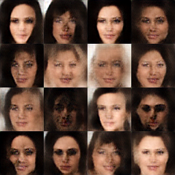

# EBGAN: Boundary Equilibrium Generative Adversarial Networks

Chainer implementation of the [EBGAN: Boundary Equilibrium Generative Adversarial Networks](https://arxiv.org/abs/1703.10717) by David Berthelot et al. Note that this is not the official implementation.

## Run

The model is trained with the aligned and cropped version of [CelebA](http://mmlab.ie.cuhk.edu.hk/projects/CelebA.html). Download and unarchive the whole dataset first. Images are by default center cropped to remove some of the background and then rescaled to (64, 64).

Images will during training be randomly sampled from the generator every certain number of iterations, and saved under a subdirectory `result/` (which is created automatically).

```bash
python train.py --celeba-root celeba/CelebA --batch-size 16 --iterations 10000 --gpu 1
```

## Samples



## Loss


