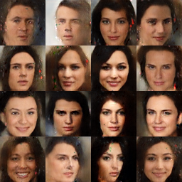
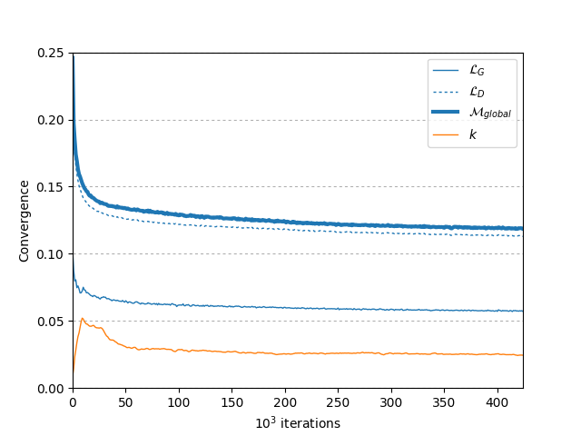

# BEGAN: Boundary Equilibrium Generative Adversarial Networks

Chainer implementation of the [BEGAN: Boundary Equilibrium Generative Adversarial Networks](https://arxiv.org/abs/1703.10717) by David Berthelot et al. Note that this is not the official implementation.



Images sampled from the generator with random noise from unif(-1, 1) after 1142000 iterations using the default parameters in [config.py](config.py).



Plotting the losses for the generator and the discriminator as well as the global loss based on the process error. The visual fidelity of the generated samples keep improving throughout the training.

The Adam learning rates are kept constant 5e-5, in contrast to the paper. Starting with a higher learning rate and then decaying it is expected to improve the results and converge faster.

## Train

The model is trained with the aligned and cropped version of [CelebA](http://mmlab.ie.cuhk.edu.hk/projects/CelebA.html). Download and unarchive the whole dataset first.

Images will during training be center cropped to remove some of the background and then rescaled to e.g. (64, 64) or (128, 128). A larger scale (output image resolution) will result in a deeper architecture. Images are randomly sampled from the generator every certain number of iterations, and saved under a subdirectory `result`.

```bash
python train.py --celeba-root celeba/CelebA --celeba-scale 64 --batch-size 16 --iterations 10000 --gpu 1
```

### Other Datasets

#### CIFAR-10

It is also possible to train the model with [CIFAR-10](https://www.cs.toronto.edu/~kriz/cifar.html) using 32 x 32 images. Chainer will download the dataset and cache it automatically.

```bash
python train.py --dataset cifar10 --batch-size 16 --iterations 10000 --gpu 1
```

However, with the same default hyperparameters as for CelebA, the results look fairly poor with centered blob-like objects.
